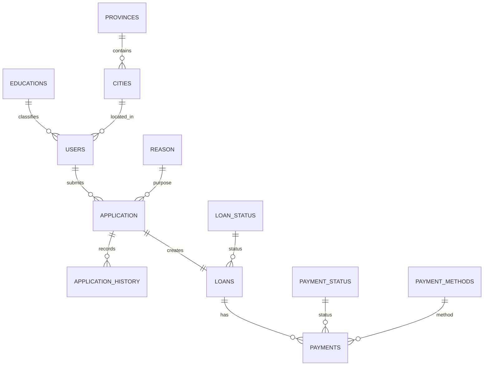

# Entity Relationship Diagram (ERD)

> **Project:** Loan Knowledge Base
>
> **Version:** 2.0
>
> **Status:** Draft (Validated from Dataset Structure)
>
> **Last Updated:** July 2026

---

# Overview

This document describes the logical Entity Relationship Diagram (ERD) of the Loan Management Database.

The database follows a **transactional relational model**, where a customer submits one or more loan applications, approved applications become loans, and loans are repaid through payment transactions.

The ERD serves as the foundation for:

- SQL Development
- Business Intelligence
- Dashboard Design
- Data Warehouse Modeling
- AI-powered SQL Generation
- Retrieval-Augmented Generation (RAG)

---

# Database Architecture

```text
                MASTER DATA
────────────────────────────────────────────

 Provinces
      │
      │
      ▼
   Cities
      │
      │
      ▼
    Users
      │
      ├──────────────┐
      │              │
      ▼              ▼
Educations       Applications
                     │
                     ▼
                 Application History
                     │
                     ▼
                  Loans
          ┌────────┼─────────┐
          ▼        ▼         ▼
 Loan Status   Payments   Reason
                  │
                  ▼
         Payment Status
                  │
                  ▼
       Payment Methods
```

---

# High-Level Relationship

```text
User

    │ 1
    │
    │
    ▼
Application

    │ 1
    │
    ▼
Loan

    │ 1
    │
    ▼
Payment
```

One customer can submit multiple applications.

One approved application creates one loan.

One loan contains multiple payment transactions.

---

# Mermaid ER Diagram



---

# Logical Relationship

## Users

Represents registered customers.

Relationship

```
Users

1

↓

Many

Applications
```

A customer may apply for multiple loans over time.

---

## Applications

Represents loan applications submitted by customers.

Each application belongs to exactly one customer.

An application can have multiple history records.

An approved application generates a loan.

---

## Application History

Stores every status change during the application process.

Example

```
Submitted

↓

Document Verification

↓

Credit Review

↓

Approved

↓

Loan Created
```

---

## Loans

Represents approved loan contracts.

Each loan originates from one application.

Each loan has one loan status.

Each loan can have many payments.

---

## Payments

Represents payment transactions.

Each payment belongs to one loan.

Each payment has:

- payment status
- payment method

---

# Master Tables

The following tables are lookup/reference tables.

| Table | Purpose |
|---------|----------|
| Educations | Customer education level |
| Cities | Customer city |
| Provinces | Province reference |
| Loan Status | Loan lifecycle status |
| Payment Status | Payment lifecycle status |
| Payment Methods | Payment channels |
| Reason | Loan purpose |

---

# Cardinality

| Parent | Child | Cardinality |
|---------|---------|------------|
| Provinces | Cities | 1 : Many |
| Cities | Users | 1 : Many |
| Educations | Users | 1 : Many |
| Users | Applications | 1 : Many |
| Applications | Application History | 1 : Many |
| Applications | Loans | 1 : 1 *(business assumption)* |
| Loans | Payments | 1 : Many |
| Loan Status | Loans | 1 : Many |
| Payment Status | Payments | 1 : Many |
| Payment Methods | Payments | 1 : Many |
| Reason | Applications | 1 : Many |

---

# Foreign Key Matrix

| Child Table | Foreign Key | Parent Table |
|-------------|-------------|--------------|
| Users | education_code | Educations |
| Users | locations_id | Cities |
| Cities | province_id *(assumed)* | Provinces |
| Applications | user_id | Users |
| Applications | reason_id | Reason |
| Application History | applications_id | Applications |
| Loans | applications_id | Applications |
| Loans | loan_status_code | Loan Status |
| Payments | loan_id | Loans |
| Payments | payment_status_code | Payment Status |
| Payments | payment_method_code | Payment Methods |

> **Note:** Relationship names are inferred from the uploaded dataset structure. They should be validated against the production database schema before implementation.

---

# Loan Lifecycle

```text
Customer Registration

↓

Loan Application

↓

Application Review

↓

Application History

↓

Approval

↓

Loan Creation

↓

Monthly Payments

↓

Loan Completed
```

---

# Payment Lifecycle

```text
Loan

↓

Installment Due

↓

Payment Recorded

↓

Payment Verified

↓

Loan Balance Updated

↓

Loan Closed
```

---

# Business Process Flow

```text
Customer

↓

Register

↓

Submit Loan Application

↓

Document Verification

↓

Credit Assessment

↓

Approval Decision

↓

Loan Issued

↓

Repayment

↓

Loan Closed
```

---

# RAG Notes

This ERD is designed to improve Retrieval-Augmented Generation (RAG) by enabling AI assistants to:

- Understand table relationships.
- Generate accurate JOIN statements.
- Explain business processes.
- Recommend analytical queries.
- Produce SQL based on database structure.
- Answer schema-related questions using relational context rather than isolated table definitions.

---

# Related Documentation

- Database Overview
- Database Schema
- Relationship Matrix
- Table Documentation
- Business Rules
- SQL Cookbook
- KPI Catalog
- Analytics Playbook
